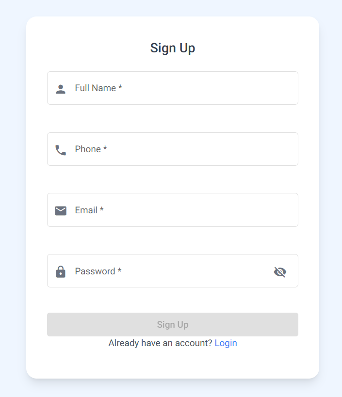
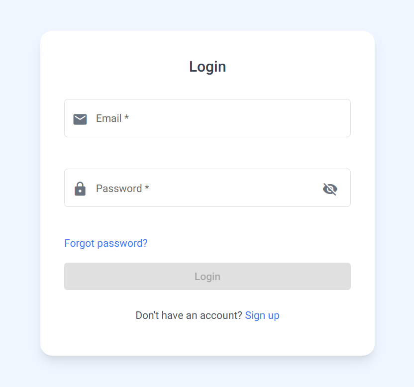
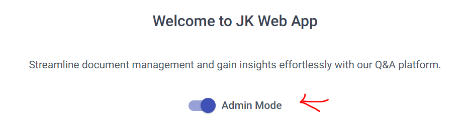
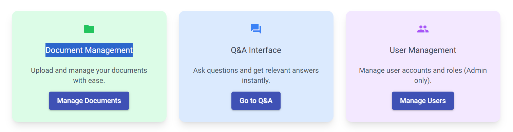
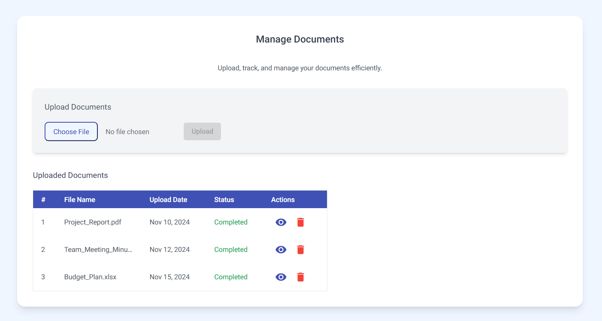
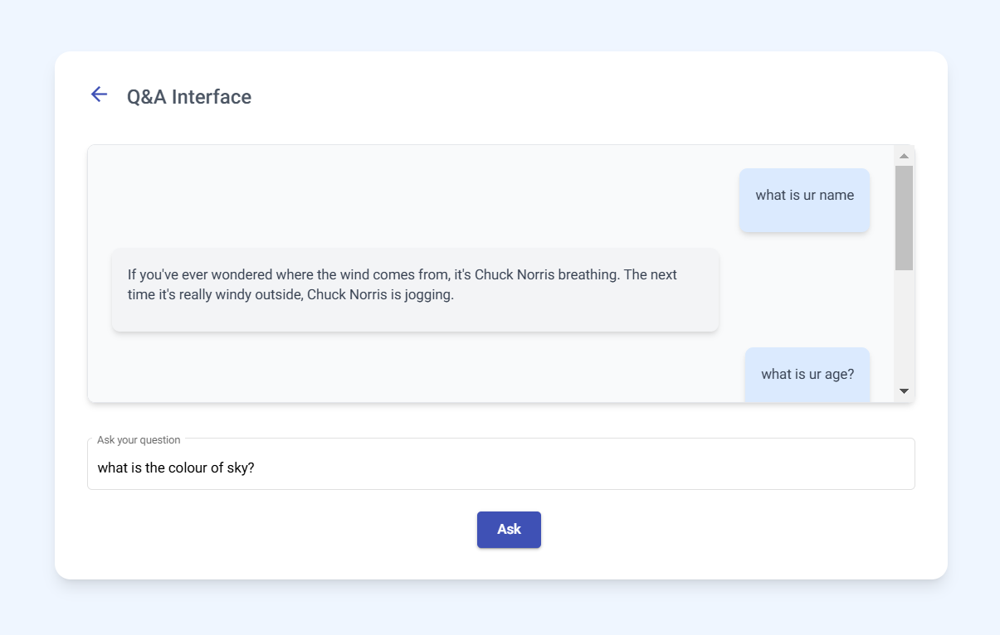
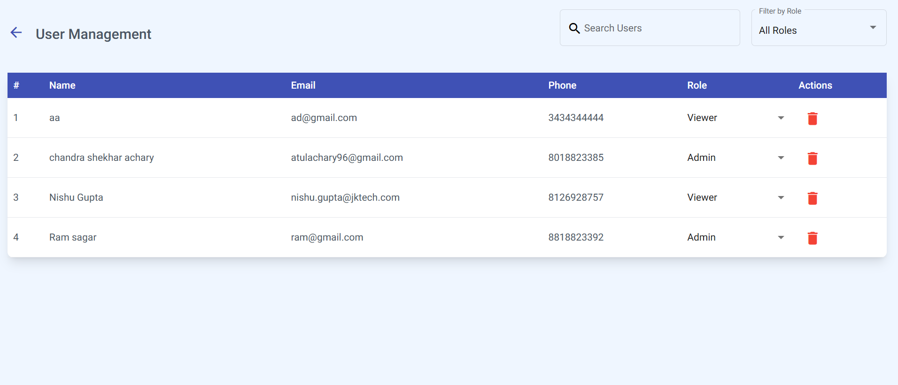

# JkApp

Live Link: [JkApp](https://jk-app-d7b46.web.app/)

This project was generated using [Angular CLI](https://github.com/angular/angular-cli) version 14.2.0.

## Technologies Used

- **Framework**: Angular  
- **Styling**: Tailwind CSS, Angular Material  
- **Backend**: Firebase Firestore (Database)  
- **Authentication**: Firebase Auth  
- **Hosting**: Firebase Hosting  

---

## Installation

1. Clone the repository:
   ```bash
   git clone https://github.com/Chandra1996/jk-app.git
   ```

2. Navigate to the project directory:
   ```bash
   cd jk-app
   ```

3. Install dependencies:
   ```bash
   npm install
   ```

4. Run the app locally:
   ```bash
   ng serve
   ```

5. Open in your browser:
   ```
   http://localhost:4200
   ```

---

## Features Overview

### 1. **Sign-Up Page**  
   - Users can create a new account with a password of at least 6 characters.  
   - After signing up, the app redirects to the login page automatically.  
   
   

### 2. **Login Page**  
   - Users can log in with their email and password.  
   - On successful authentication, users are redirected to the home page.  
   
   

### 3. **Home Page**  
   The home page consists of three main sections:  

   - **Admin Mode Toggle**  
     - By default, new users are assigned the "Viewer" role.  
     - Admin mode can be toggled on to enable user management.  
     

   - **Page Links**  
     - Navigate to different pages via cards in the center of the page.  
     

   - **Logout Button**  
     - Logs out the user and redirects them to the login page.  
     

### 4. **Document Management**  
   - Upload and manage documents via the "Document Management" page.  
   - View uploaded documents in a table, with options to view or delete them.  
   - Includes an upload progress bar.  
   
   

### 5. **Q&A Interface**  
   - A page to interact with an AI-based Q&A system.  
   - For demonstration, the app uses the [Chuck Norris API](https://api.chucknorris.io/jokes/random) to generate random answers.  
   
   

### 6. **User Management** (Admin Only)  
   - Accessible only to users with the "Admin" role.  
   - Admins can:
     - View user details.  
     - Search users by name.  
     - Filter users by role.  
     - Assign roles or delete users.  
   
   

---

## Usage Guide

1. **Sign-Up:**  
   - Access the sign-up page via the link below the login button.  
   - Fill in the details and sign up to be redirected to the login page.  

2. **Login:**  
   - Enter your credentials to access the home page.  

3. **Navigate the App:**  
   - Use the admin mode toggle and page links on the home page to explore features.  

4. **Document Management:**  
   - Upload, view, and manage documents easily.  

5. **Interact with Q&A Interface:**  
   - Ask questions and receive responses generated by the API.  

6. **Manage Users (Admin):**  
   - Access user management tools for advanced administrative functionality.  

---

## Deployment

This app is hosted on Firebase Hosting.

---

Enjoy using JkApp! 🚀
